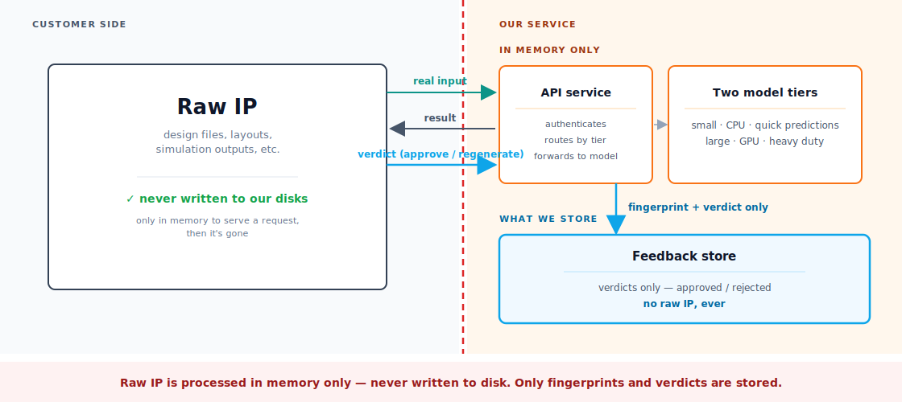

# [priv] shrouded-inference

A security-focused ML model deployment: with near-zero-cost when idle, and fully anonymized metrics to improve the model(s) - without compromising customers' IP.

Simplified User Story Architecture:
<p align="center">
  
</p>

Full Architecture and rationale: [docs/arch-decisions.md](docs/arch-decisions.md).

## Notable design choices

- **All inputs encrypted with Customer Managed Keys, unreadable to the AWS deployer** — admin access returns ciphertext; raw payloads auto-deleted within 24 hours.
- **API keys unrecoverable from a breach** — only SHA-256 hashes stored, raw values never leave Secrets Manager.
- **No long-lived AWS credentials** — short-lived OIDC tokens, trust pinned to one branch on one repo.
- **Near-zero idle cost** — both model endpoints scale to zero; ~$25/month floor.
- **Feedback without labeling overhead** — binary approve/regenerate verdict, keyed by hashed user + payload.

## Iteration-speed choices

- **Infra regressions caught before main** — every PR gets a throwaway copy of the full stack, torn down on close.
- **New model tier in a five-line diff** — both endpoints share one reusable `AsyncSagemakerEndpoint` construct.
- **Prod redeploys cut from ~50 min to ~3** — content-addressed ECR tags, retagged from the PR's already-built image.
- **Env teardowns are true no-ops on shared state** — secrets lifecycle owned by prod, other envs inherit by name.
- **`/healthz` reports the deployed commit, images stay cacheable** — SHA injected at deploy time, not baked at build.

## Threat model

In scope:

- Customer IP — never persisted in raw form
- API auth — keys stored as fingerprints
- Deploy credentials — short-lived, branch-pinned, no static keys
- Blast radius — per-tier IAM scoping, name-based secret imports
- Audit — every request logged at ALB, dispatcher, SageMaker, and CloudTrail layers
- Cost ceiling — scale-to-zero on both endpoints
- Operator visibility — admin access reads ciphertext, not customer data; key access is logged
- PR-env blast radius — each ephemeral environment has its own separate encryption key

## First-time setup / repo rename recovery

The GitHub Actions OIDC deploy role (`gnn-serving-github-actions-deploy`) trust policy is
sourced dynamically from `GITHUB_REPOSITORY` at CDK synth time. CI keeps it in sync via
`cdk deploy --all` on every push to `main`. However, CI cannot self-heal for:

1. **First-time setup** — the OIDC role doesn't exist yet.
2. **After a GitHub repo rename** — the existing trust policy is stale before the next CI run can fix it.

Recovery (one-shot local CLI, with `gnn-deployer` or admin AWS creds):

```sh
eval "$(direnv export bash)"   # source .envrc
cd infra
npx cdk deploy GithubOidcStack \
  --context githubRepo=$(gh repo view --json nameWithOwner -q .nameWithOwner) \
  --require-approval never
```

Subsequent pushes to `main` keep the trust policy aligned automatically.

---
