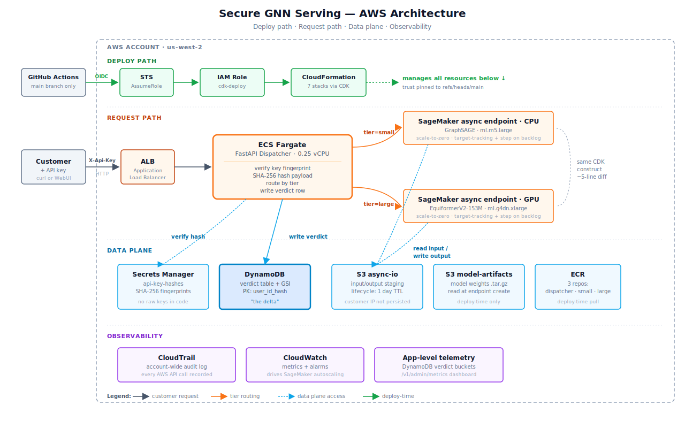

# Architecture Decisions

Companion to the [project README](../README.md). This covers the design tradeoffs, the components themselves, and what would change with more time.

Scroll down ⬇️ for **full system architecture** diagram!

## Design decisions

- **Two model tiers, not one** — different cost profiles, priced independently, GPU billed only when in use
- **Both tiers idle at zero** — pay for inference time, not standby; ~$25/mo idle baseline
- **One reusable building block for all tiers** — adding a new tier is a five-line diff
- **Async by default** — no synchronous timeout to violate, which is what enables scale-to-zero
- **Raw inputs never touch disk** — fingerprinted in memory, then discarded
- **Customer data unreadable to operators** — encryption keys held by the running app only; admin storage access sees ciphertext
- **Feedback is binary, not labeled** — approve / regenerate is the entire training signal

---

  

---

## Architecture overview

The request flow, end to end:

- **API router** — single entry point; authenticates, picks the right model, returns the result
- **Small inference VM** — CPU; runs the lighter model; idles at zero between requests
- **Large inference VM** — GPU; runs the heavier model; idles at zero between requests
- **In-flight bucket** — temporary holding for input + output while the model runs; cleared after fetch
- **Feedback store** — records every approve / regenerate verdict, keyed by customer + input fingerprint
- **Key store** — holds API key fingerprints; raw keys never persisted
- **Web UI** — served by the router itself; browser-based trial without writing code

High-Level Flow:
- Upon a customer request, the right GNN is routed to (a fast cheap one or a slow powerful one)
- Answer is returned, and option to confirm if they were happy with it.
    - If request re-sent within 2min, customer assumed unhappy with that generation.
- It never keeps a copy of what they asked, and the models themselves stay locked down.

---

## With more time

Operator-blind encryption is already in place; each of these is a bigger shift beyond it:

- **Customer-supplied keys** — remove account root from the CMK trust policy; customers bring their own key from their own account, placing it fully outside operator reach even via root.
- **Confidential compute** — run inference inside hardware enclaves so even the cloud provider can't see customer inputs. The strongest privacy guarantee currently available.
- **Customer-side encryption** — inputs leave the customer's machine encrypted with their own key; decryption happens only inside the inference container.
- **Per-customer dedicated deploys** — instead of multi-tenant on shared endpoints, sensitive customers get their own isolated stack in their own cloud account. Same code, separate blast radius.
- **Active distillation detection** — a model on the feedback table flags suspicious query patterns (high rates, anomalous distributions) rather than just surfacing them on a dashboard.
- **Federated training** — verdicts never come back at all; an "improvement" model trains on the customer's premises and ships gradients only.
